<p align="center">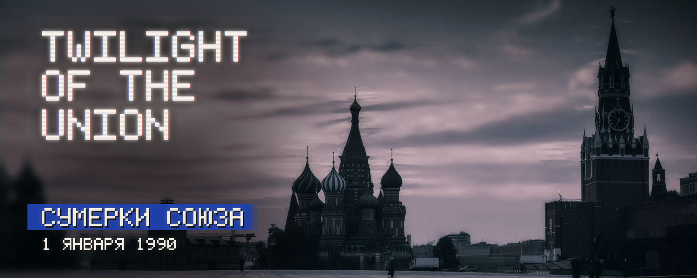</p>

<p align="center"><b>Мод для Hearts of Iron IV о последних годах Советского Союза</b></p>

<p align="center"><code>HOI4 1.19</code> · <code>версия 0.1</code> · <code>русский / English</code> · <code>ранняя разработка</code></p>

<p align="center"><a href="#about">О моде</a> · <a href="#map">Карта</a> · <a href="#screens">Экраны</a> · <a href="#flags">Флаги</a> · <a href="#spirits">Нацдухи</a> · <a href="#install">Установка</a> · <a href="#dev">Разработка</a> · <a href="#plans">Планы</a> · <a href="#sources">Источники</a> · <a href="#english">English</a></p>

<a name="about"></a>

1 января 1990 года. Берлинская стена пала семь недель назад. Партия ещё у власти. Пять лет перестройки расшатали всё и ничего не исправили: Прибалтика считает дни до независимости, Кавказ горит, полки магазинов пусты. Варшавский договор расползается по швам, а Вашингтон ещё не решил, что делать с победой в холодной войне.

> Союз ещё можно реформировать, удержать силой или отпустить. Оставить как есть уже нельзя.

**Twilight of the Union** — мод для Hearts of Iron IV 1.19. Версия 0.1 — это мир 1990 года на ванильной карте, новый интерфейс в стиле позднесоветского эфира и семь стартовых национальных духов СССР. Армий, технологий, фокусов и событий пока нет.

<p align="center">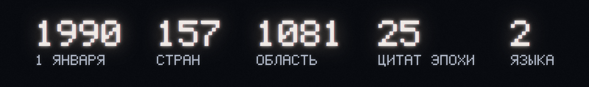</p>

<a name="map"></a>

Карта ванильная: провинции, области, рельеф и стратегические регионы не тронуты. Поверх них — политический мир на утро 1 января 1990 года.

<p align="center"><br><sub>Превью политической карты: ванильные провинции, владельцы и цвета мода. Собирает <code>tools/render_political_map.py</code></sub></p>

### Что на карте

- **1081 область.** Владельцы, ядра и претензии 1990 года.
- **157 стран.** У каждой есть столица, правящая партия и популярность идеологий. В демократиях проходят выборы раз в четыре года.
- **Девять стран, которых нет в ванилле:** КНДР, Маврикий, Сейшельские Острова, Коморские Острова, Сан-Томе и Принсипи, Кирибати, Тувалу, Науру, Барбадос.
- **Европа.** СССР с Прибалтикой, Молдавией, Калининградом, Закарпатьем, Выборгом и Печенгой. Польша по Одеру и Нейсе. ФРГ и ГДР. Чехословакия. Югославия с Истрией. Южная Добруджа у Болгарии, Додеканес у Греции. Мальта и Кипр независимы.
- **Азия.** Две Кореи. Тайвань. КНР с Маньчжурией и Тибетом. Северный и Южный Йемен. Индия, Пакистан, Бангладеш. Вьетнам, Лаос, Камбоджа. Южный Сахалин и Курилы у СССР. Гонконг британский, Макао португальский, Восточный Тимор у Индонезии.
- **Африка** деколонизирована. Эритрея в составе Эфиопии. Намибия под управлением ЮАР: независимость будет 21 марта. Западная Сахара у Марокко.
- **Претензии.** ФРГ — на ГДР. Япония — на Курилы. КНР — на Тайвань, Гонконг и Макао. Индия и Пакистан — на Кашмир друг друга. Аргентина — на Фолкленды. Испания — на Гибралтар. Турция — на Кипр.
- **Названия.** Все 157 стран названы по-русски и по-английски, для каждой идеологии: при смене власти название не откатится к 1936 году. 68 областей и 48 городов получили названия 1990 года: Волгоград, Калининград, Гданьск, Вроцлав, Щецин, Хошимин, Киншаса, Хараре.
- **Палитра.** Тёмная и насыщенная. Яркость цветов стран ×0,70, насыщенность ×1,12, 51 цвет подобран вручную. Ванильное приглушение цветов отключено. Море почти чёрное: затемнены колормапы воды и шейдер воды. Суша приглушена.
- **Стартовые скрипты 1936 года** вырезаны: гражданская война в Испании, китайские милитаристы, колонии, марионетки DLC. На мире 1990 года они роняли игру.

### Чего пока нет

- **Армий, флотов и авиации.** Ни у кого.
- **Технологий.** Страны начинают без изученных технологий.
- **Своих деревьев фокусов и событий.**
- **Исторических лидеров** — кроме Михаила Горбачёва в СССР и Джорджа Буша в США. Партии везде названы по-ванильному, как в 1936 году.
- **Своих стартовых параметров у стран.** Стабильность 50 % и поддержка войны 20 % одинаковы у всех сгенерированных стран.
- **Точной границы двух Германий.** Граница ФРГ и ГДР идёт по ванильным областям: Любек в ГДР, Берлин целиком в ГДР, Западного Берлина нет. Триест в Югославии. Сеута и Мелилья вместе с Тетуаном у Марокко. Перенос провинций между ванильными областями роняет игру без дампа (0xc0000409), причина не найдена. Точная карта 1990 года — в планах.

<a name="screens"></a>

Интерфейс сделан как эфир позднесоветского телевидения. Белые титры пиксельным шрифтом знакогенератора 5×7 с мягким свечением. Один акцентный цвет — синяя плашка под активной строкой, с жёстким двухступенчатым хвостом справа. Под текстом — чёрная тень. Вместо панелей — мягкие затемнения. Фотографии переведены в холодные сумерки: тёмные силуэты, сине-серые полутона, лиловый свет, цветовой сдвиг SECAM, зерно.

Рамок, уголков, печатей и орнаментов нет.

<p align="center">
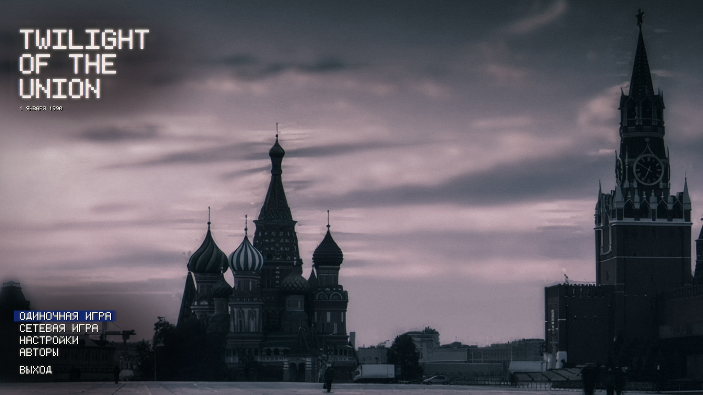
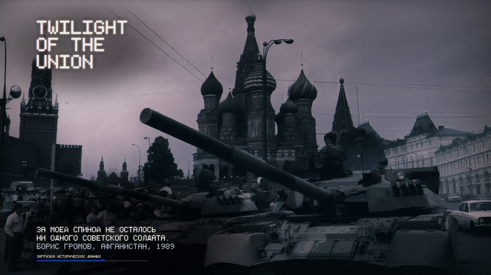
</p>

**Главное меню.** Красная площадь в сумерках. Логотип набран пиксельным шрифтом, под ним дата: 1 января 1990. Пункт под курсором встаёт на синюю плашку. Синие купола Покровского собора приглушены: синий на экране один.

**Экран загрузки.** Четыре архивных кадра в том же сумеречном тоне. На двух у публичных фигур глаза закрыты чёрной полосой. Внизу — субтитр: одна из 25 цитат 1983–1993 годов, от «Империи зла» до «Хотели как лучше». Цитаты заменили игровые подсказки 1936 года. Под цитатой — подпись, строка статуса и тонкая синяя полоса загрузки.

<p align="center">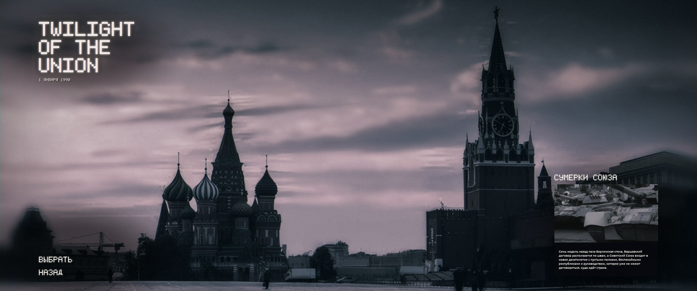</p>

**Выбор сценария.** Один сценарий — «Сумерки Союза», 1 января 1990 года. Логотип и дата остаются на месте. Справа внизу — кадр: колонна танков на Красной площади, август 1991 года. Под кадром — вводный текст.

<p align="center">
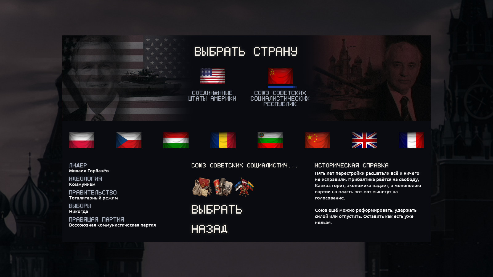
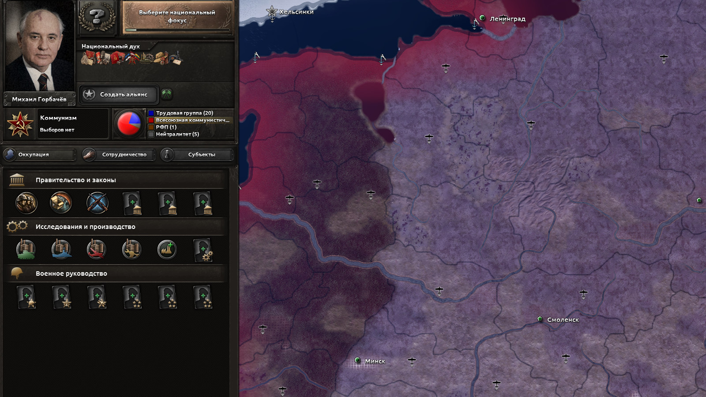
</p>

**Выбор страны.** Две главные страны — США и СССР. Их баннеры собраны из флага, портрета лидера и хроники: Буш и «Абрамсы», Горбачёв и танки на Красной площади. Ниже восемь стран: Польша, Чехословакия, Венгрия, Румыния, Болгария, Китай, Великобритания, Франция. У каждой — справка на начало 1990 года. Выбранная страна отмечена синей полосой под флагом. Любую другую страну можно выбрать на карте.

**В игре.** HUD — первая волна. Ванильные текстуры верхней панели, кнопок, заголовков, полос прокрутки и политического экрана перекрашены в палитру мода. Формы и орнамент на месте, цвет приглушён: от тёплого чёрного до песочного. На кадре — СССР: Горбачёв, семь национальных духов и ванильные партии.

<p align="center">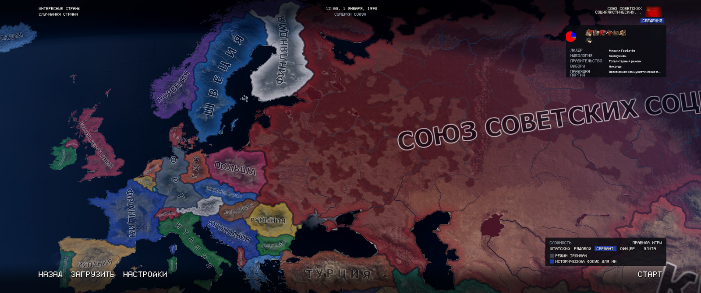</p>

**Лобби.** Настройка игры идёт поверх карты 1990 года. Карта остаётся картинкой. На ней только то, что несёт эфирный кадр: мягкие чёрные полосы сверху и снизу, подписи по краям, синяя плашка для выбора, тёмные доски без рамок под сведениями о стране и сложностью.

<sub>Кадры сняты в игре при 3440×1440 и масштабе интерфейса 1.0. Экран загрузки — превью из текстур и шрифтов мода, его собирает <code>tools/build_menu_gfx.py</code>.</sub>

<a name="flags"></a>

<p align="center">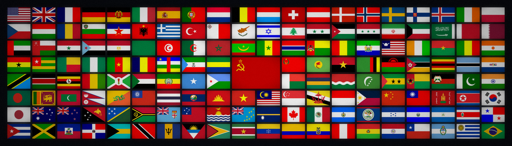</p>

Все 157 стран 1990 года по регионам, Советский Союз — в центре. Флаг каждой страны выбран так же, как его выбирает игра: сначала флаг правящей партии, потом общий.

**38 флагов 1990 года** взяты с Wikimedia Commons там, где ванилла показывает 1936 год или страны нет вовсе: Египет, Ирак, Иран, Испания, Румыния, ЮАР, Заир, Бирма и другие. У КНР пятизвёздный флаг, у КНДР свой. Новый флаг записан для всех идеологий и при смене власти не меняется.

<a name="spirits"></a>

<p align="center">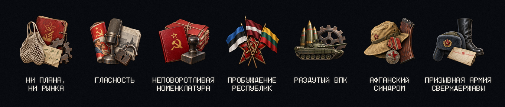</p>

Советский Союз начинает с семью национальными духами. Убрать их пока нельзя: фокусы и события, которые должны это делать, ещё не написаны. Иконки — предметы эпохи, вырезанные без фона, как наклейки.

| Дух | Коротко | Эффект |
|---|---|---|
| **Ни плана, ни рынка** | Перестройка сломала старую систему и не построила новую. | Товары народного потребления +20 %, максимальная эффективность производства −10 %, рост эффективности −15 %, стабильность −10 % |
| **Гласность** | Страна впервые говорит открыто. Всё громче — о том, что партия ей не нужна. | Поддержка демократии +0,05 в день, защита от дрейфа −10 %, политическая власть +5 % |
| **Неповоротливая номенклатура** | Аппарат не может остановить реформы и не хочет их проводить. | Политическая власть −0,3 в день, политические советники дороже на 20 % |
| **Пробуждение республик** | Прибалтика требует независимости, в Нагорном Карабахе идёт война. | Стабильность −10 %, призывное население −10 % |
| **Раздутый ВПК** | Заводы выпускают танки, которые некуда девать, и не умеют делать кастрюли. | Выпуск военных заводов +10 %, перевод военных заводов в гражданские дороже на 25 % |
| **Афганский синдром** | Пятнадцать тысяч погибших и ветераны, о которых не хотят слышать. | Поддержка войны −15 %, организация дивизий −5 % |
| **Призывная армия сверхдержавы** | Почти четыре миллиона под ружьём. Держится на призыве, дедовщине и старых складах. | Призывное население +15 %, время подготовки −10 %, армейский опыт −10 % |

<a name="install"></a>

1. Скачайте репозиторий: **Code → Download ZIP** или
   ```
   git clone https://github.com/ilovevodkaa/Twilight-of-the-Union.git "Twilight of the Union"
   ```
   Папку из ZIP-архива переименуйте в `Twilight of the Union`.
2. Положите её в каталог модов:
   ```
   Документы\Paradox Interactive\Hearts of Iron IV\mod\Twilight of the Union
   ```
   Если документы хранятся в OneDrive, каталог лежит в `OneDrive\Документы\...`.
3. Рядом с папкой, в каталоге `mod`, создайте файл `Twilight of the Union.mod`. Скопируйте в него содержимое `descriptor.mod` и добавьте последней строкой путь к папке мода, с прямыми слэшами:
   ```
   path="C:/Users/<имя>/Documents/Paradox Interactive/Hearts of Iron IV/mod/Twilight of the Union"
   ```
4. **Если в пути есть кириллица** («Документы», имя пользователя), лаунчер может его не прочитать. Тогда укажите короткий путь 8.3. Его выводит команда в `cmd`:
   ```
   for %I in ("C:\Users\<имя>\OneDrive\Документы\Paradox Interactive\Hearts of Iron IV\mod\Twilight of the Union") do @echo %~sI
   ```
   Короткие имена видны и в `dir /x`. Результат запишите в `path` с прямыми слэшами, например:
   ```
   path="C:/Users/<имя>/OneDrive/7496~1/PARADO~1/HEARTS~1/mod/TWILIG~1"
   ```
   Короткие имена на каждой машине свои: пример не копируйте.
5. Включите мод в лаунчере. В игре выберите сценарий «Сумерки Союза».

**Совместимость.** Hearts of Iron IV 1.19. Мод заменяет историю всех стран и областей, сценарии, экраны загрузки и фон меню. С модами, которые меняют то же самое, он несовместим.

**Масштаб интерфейса.** 1.0 или 2.0. При дробном масштабе пиксельный шрифт размывается. Экраны загрузки и выбора сценария проверены вплоть до 1280×720.

<a name="dev"></a>

Почти всё в `gfx/`, `history/`, `map/`, `common/countries/` и `localisation/*/replace/` собрано скриптами. Сгенерированные файлы руками не правятся. Правится скрипт или его исходники в `tools/src/` и `tools/world1990/`.

Вручную написаны: история СССР и США (`history/countries/SOV`, `USA`), национальные духи (`common/ideas/TOTU_SOV.txt`), персонажи, даты и палитра (`common/defines/`), разметка экранов (`interface/*.gui`), тексты и цитаты на русском и английском.

### Структура

```
common/            сценарий, персонажи, нацдухи СССР, даты и палитра, страны и цвета, on_actions без 1936 года
gfx/               шрифты, текстуры меню и HUD, экраны загрузки, портреты, флаги, шейдер воды
history/           области и страны 1990 года (генерируются; SOV и USA написаны вручную)
interface/         разметка меню, загрузки, сценария, выбора страны и лобби; спрайты
localisation/      русский и английский; английские тексты для остальных языков игры
map/               buildings.txt и колормапы суши и моря (генерируются)
tools/             скрипты сборки
  src/             исходные фото, флаги, иконки
  world1990/       границы, страны, названия и флаги 1990 года
docs/images/       картинки README; readme/ собирает render_readme.py
```

### Что нужно

- Python 3.11, Pillow и numpy: `pip install pillow numpy`. Собиралось на Pillow 12.2 и numpy 2.4.
- Установленная Hearts of Iron IV 1.19. Скрипты читают из неё ванильные файлы и пишут поверх только то, что изменилось.
- Скрипты карты, стиля карты, HUD и превью карты ищут игру в `D:\steam\steamapps\common\Hearts of Iron IV` и `C:\Program Files (x86)\Steam\steamapps\common\Hearts of Iron IV`. Другой путь — ключ `--game "путь"`.
- `build_fonts.py`, `build_menu_gfx.py` и `render_readme.py` берут путь из переменной окружения `HOI4_DIR`. По умолчанию — `D:\steam\steamapps\common\Hearts of Iron IV`.

### Порядок сборки

```bash
pip install pillow numpy

python tools/build_world_1990.py               # мир 1990 года: области, страны, цвета, названия, флаги
python tools/build_map_style.py                # чёрное море, приглушённая суша, шейдер воды
python tools/build_fonts.py                    # шрифты титров; английские тексты для прочих языков
python tools/build_menu_gfx.py                 # меню, загрузка, сценарий, выбор страны, лобби, портреты
python tools/build_hud_gfx.py                  # ванильный HUD в палитре мода
python tools/gen_icons.py --convert-only       # иконки нацдухов из готовых PNG, без запросов к API
python tools/render_political_map.py           # превью карты: docs/images/map_1990.jpg
python tools/render_readme.py --shots <папка>  # картинки README в docs/images/readme/
```

| Скрипт | Что делает |
|---|---|
| `build_world_1990.py` | Читает ванильные области, здания, цвета и флаги. Пишет 1081 область и 157 стран, `map/buildings.txt`, девять новых тегов, `colors.txt`, названия стран, областей и городов, флаги. Копирует ванильные `on_actions` без `on_startup`. Данные — в `tools/world1990/`: `borders.py` (владельцы, ядра, претензии), `countries.py` (названия, власть, популярность, цвета), `names.py` (области и города), `flags.py` (флаги). |
| `build_map_style.py` | Колормапы в `map/terrain/`: суша — яркость ×0,72, насыщенность ×0,75; вода — яркость ×0,10. Правит `gfx/FX/pdxwater.shader`: отражение неба ×0,08. |
| `build_fonts.py` | Шесть битмап-шрифтов `gfx/fonts/totu_*.fnt` + `.dds`: глифы 5×7 с кириллицей, скруглением и свечением ЭЛТ, у части — с чёрной тенью. Проверяет, что у каждой строки меню, цитаты и названия страны есть глифы, а цитаты укладываются в 40 знаков и три строки. Пишет английские тексты для восьми языков игры без перевода. Превью — `tools/preview/font_test.png`. Запускать до `build_menu_gfx.py`: его превью рисуются этими шрифтами. |
| `build_menu_gfx.py` | Все текстуры интерфейса из фото в `tools/src/`: фон меню и логотип, затемнения, плашки титров, экраны загрузки и полоса прогресса, кадр сценария, баннеры и полосы выбора страны, полосы, доски и флажки лобби, портреты лидеров 156×210. Превью — в `tools/preview/`. `--bg` подставляет другой фон меню. |
| `build_hud_gfx.py` | Перекрашивает ванильные текстуры HUD (верхняя панель, плитки, кнопки, заголовки, прокрутка, политический экран) в палитру мода. Пишет по ванильным путям в `gfx/interface/`, поэтому `.gfx` и `.gui` не меняются. |
| `gen_icons.py` | Иконки национальных духов через OpenAI-совместимый API картинок, модель по умолчанию `gpt-image-2.5-flare`. Исходные PNG лежат в `tools/src/icons/` и закоммичены. Без аргументов генерирует недостающие, с именами — перегенерирует указанные, `--convert-only` пересобирает `gfx/interface/ideas/totu/*.dds` и `interface/totu_ideas.gfx` без запросов. |
| `render_political_map.py` | Приблизительная политическая карта из ванильных провинций, владельцев и цветов мода: `docs/images/map_1990.jpg`. Ключи `--crop x0 y0 x1 y1`, `--scale`, `--out`. |
| `render_readme.py` | Картинки README в `docs/images/readme/`: шапка, заголовки разделов, цифры, галерея экранов, стена флагов, полоса нацдухов. Текст рисуется шрифтами из `gfx/fonts/`, поэтому скрипт запускается после `build_fonts.py` и `build_menu_gfx.py`. `--shots` — папка со скриншотами 3440×1440 при масштабе интерфейса 1.0 (`menu_full.png`, `scenario_full.png`, `country_full.png`, `lobby_full.png`, `politics_full.png`); без неё галерея пропускается, кроме экрана загрузки. `--only hero,headers,gallery,flags,spirits,stats` собирает отдельные части. Кадры обрезаны так, чтобы оверлеи Steam, Discord и NVIDIA не попали в картинку, но перед публикацией их стоит просмотреть. |

Вспомогательные скрипты:

- `build_bookmarks.py` пишет сценарий `common/bookmarks/totu_1990.txt`: сам сценарий и скрытую копию. Окно сценариев появляется, только если их два.
- `fetch_flags.py` один раз скачивает флаги с Wikimedia Commons в `tools/src/flags/`. PNG уже в репозитории.
- `preview_country.py` и `render_docs.py` собирают превью экранов из готовых текстур (`render_docs.py` пишет их в `docs/images/`).

**Ключ для иконок.** `gen_icons.py` берёт ключ из переменной `TOTU_IMAGE_API_KEY` или из файла, путь к которому лежит в `TOTU_IMAGE_KEY_FILE`. Адрес API и модель — `TOTU_IMAGE_BASE_URL` и `TOTU_IMAGE_MODEL`. Без ключа работает только `--convert-only`.

```powershell
$env:TOTU_IMAGE_API_KEY = "<ключ>"
python tools/gen_icons.py
```

Список иконок и промпты — в начале `gen_icons.py`. Экраны загрузки (`LOADING_SCREENS`) и портреты (`PORTRAITS`) — в `build_menu_gfx.py`: положите фото в `tools/src/` и перезапустите скрипт.

<a name="plans"></a>

- [x] Стартовая дата 1 января 1990 года, один сценарий
- [x] Мир 1990 года на ванильной карте: 1081 область, 157 стран, названия, флаги, тёмная палитра, чёрное море
- [x] Интерфейс в стиле эфира: меню, загрузка, сценарий, выбор страны, лобби
- [x] Пиксельные шрифты титров с кириллицей
- [x] 25 цитат эпохи на экранах загрузки
- [x] Семь стартовых национальных духов СССР с иконками
- [x] HUD, первая волна: ванильные текстуры в палитре мода
- [ ] Точная карта 1990 года: граница ФРГ и ГДР, Западный Берлин, Триест, Сеута и Мелилья
- [ ] Лидеры, партии и правительства всех стран на 1990 год
- [ ] Армии, флоты и авиация
- [ ] Технологии 1990 года
- [ ] Фокусы СССР и США, национальные духи США
- [ ] События 1990–1991 годов

<a name="sources"></a>

- **Флаги 1990 года** — Wikimedia Commons, национальные флаги, общественное достояние. Список файлов — в `tools/fetch_flags.py`. Флаги КНР и КНДР взяты из игры.
- **Танки M1A1 Abrams** на баннере США — [«Abrams in formation»](https://commons.wikimedia.org/wiki/File:Abrams_in_formation.jpg), PHC D. W. Holmes II, ВМС США, 1991. Общественное достояние.
- **Остальные фотографии** — архивные материалы эпохи.
- **Иконки национальных духов** сгенерированы моделью gpt-image-2.5-flare. Промпты — в `tools/gen_icons.py`.
- **Пиксельный шрифт и логотип** нарисованы в коде: `tools/build_menu_gfx.py`, `tools/build_fonts.py`.
- **Карта, текстуры HUD, шейдер воды и `on_actions`** — переработанные файлы Hearts of Iron IV, © Paradox Interactive. Для мода нужна установленная игра.

<a name="english"></a>

**Twilight of the Union** is a Hearts of Iron IV 1.19 mod about the last years of the Soviet Union. The game starts on 1 January 1990. Version 0.1.

<p align="center">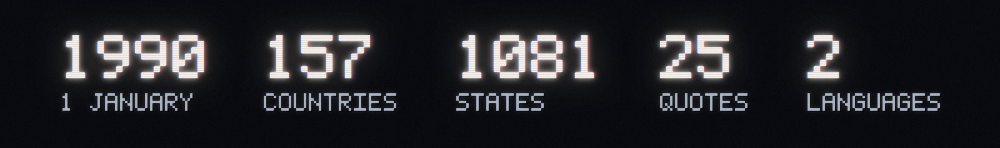</p>

**What is in**

- **The world of 1 January 1990 on the vanilla map.** 1990 owners, cores and claims for all 1081 states. 157 countries with capitals, ruling parties and popularities, nine of them new tags. 1990 names in English and Russian for every ideology; 68 states and 48 cities renamed. 38 period flags from Wikimedia Commons. A dark, saturated palette, a near-black sea, muted land. The 1936 startup scripts are stripped.
- **A broadcast frontend** in the look of late-Soviet TV captions: a 5x7 pixel logo and caption fonts with Cyrillic, one blue caption plate, black drop shadows, soft scrims, dusk-graded archive photos. Main menu, loading screens with 25 quotes from 1983–1993, scenario picker, country selection, game lobby. The vanilla HUD is re-graded to the mod palette.
- **Seven starting national spirits of the USSR**, from Neither Plan nor Market to Conscript Army of a Superpower.
- **Languages:** English and Russian. Other game languages show the menu, scenario and quotes in English.

Screenshots, the map, the flags and the spirits are shown in the Russian sections above.

**What is not in yet**

No armies, navies or air forces. No technologies. No focus trees or events of its own. Historical leaders only for the USSR (Gorbachev) and the USA (Bush); party names are vanilla. The inner German border follows vanilla states: Lübeck and all of Berlin are in the GDR, Trieste is in Yugoslavia, Ceuta and Melilla go to Morocco. Moving provinces between vanilla states crashes the game; a precise 1990 map is planned.

**Install**

1. Download the repository and name the folder `Twilight of the Union`.
2. Put it into `Documents/Paradox Interactive/Hearts of Iron IV/mod/`.
3. Next to it, create `Twilight of the Union.mod`: copy `descriptor.mod` and add a last line `path="C:/.../mod/Twilight of the Union"` with forward slashes.
4. If the path contains non-Latin characters, use its 8.3 short form. In `cmd`: `for %I in ("C:\...\Twilight of the Union") do @echo %~sI`.
5. Enable the mod in the launcher and pick the "Twilight of the Union" scenario.

Use UI scale 1.0 or 2.0: fractional scales blur the pixel font.

**Build**

Python 3.11, `pip install pillow numpy`, and an installed copy of HOI4 1.19. The map, map style, HUD and map preview scripts look for it under `D:\steam\...` and `C:\Program Files (x86)\Steam\...` or take `--game PATH`; the font, menu and README art scripts read `HOI4_DIR` (default `D:\steam\...`). Run in this order: `build_world_1990.py`, `build_map_style.py`, `build_fonts.py`, `build_menu_gfx.py`, `build_hud_gfx.py`, `gen_icons.py --convert-only`, `render_political_map.py`, then `render_readme.py --shots DIR` for the README art (DIR holds 3440x1440 screenshots at UI scale 1.0). Regenerating spirit icons needs `TOTU_IMAGE_API_KEY` for an OpenAI-compatible image API (default model `gpt-image-2.5-flare`). Generated files are not edited by hand.

**Credits**

1990 flags: Wikimedia Commons, public domain. «Abrams in formation», PHC D. W. Holmes II, US Navy, 1991, public domain. Other photos: period archive material. Spirit icons: generated with gpt-image-2.5-flare. Map, HUD textures, water shader and `on_actions` are derived from Hearts of Iron IV, © Paradox Interactive.
