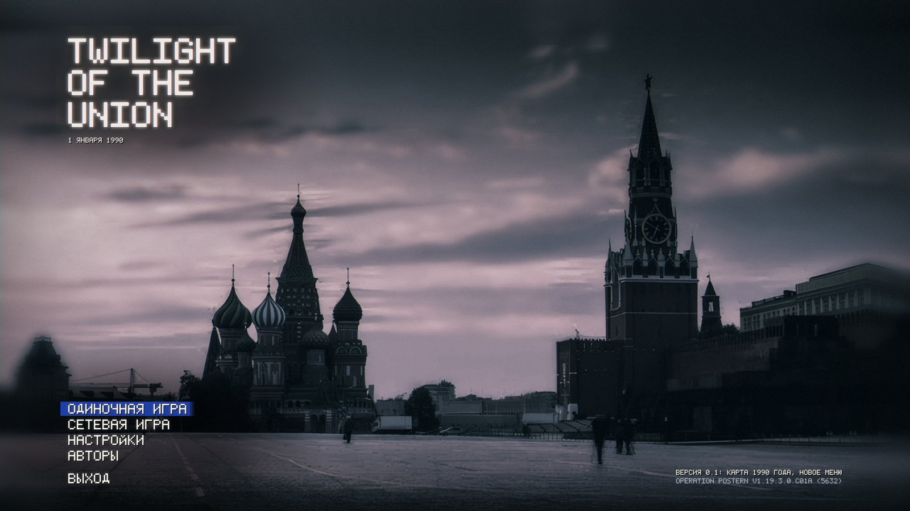
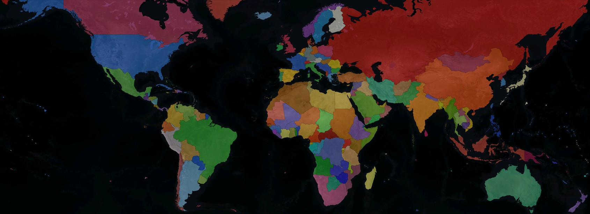
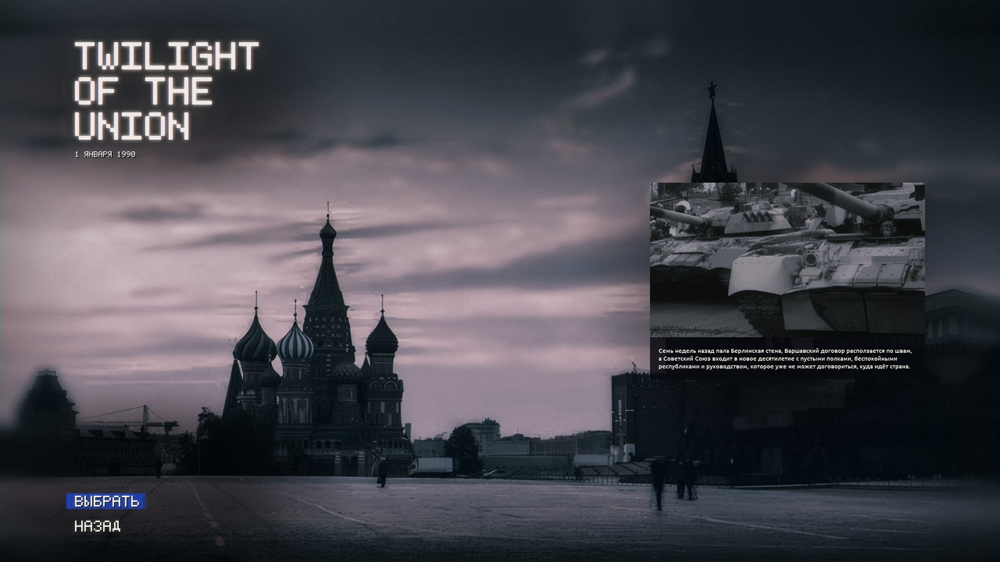
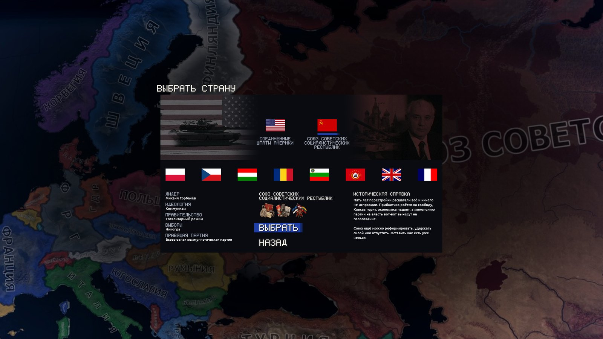
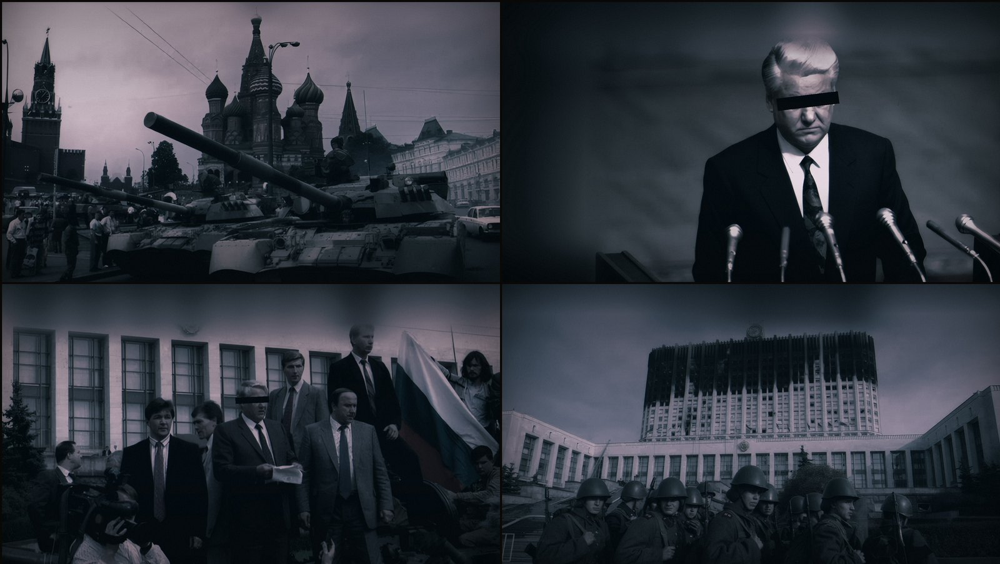

<div align="center">

# Twilight of the Union

**Сумерки Союза** — мод для Hearts of Iron IV о последних годах Советского Союза

*1 января 1990 года. Стена пала. Партия всё ещё у власти. Надолго ли — решать вам.*




[О моде](#о-моде) · [Скриншоты](#скриншоты) · [Установка](#установка) · [Разработка](#разработка) · [English](#english)

</div>

---

## О моде

Пять лет перестройки расшатали всё и ничего не исправили. Прибалтика считает дни до независимости, Кавказ горит, полки магазинов пусты, армия возвращается из Афганистана в страну, которую больше не узнаёт. Варшавский договор расползается по швам, а Вашингтон ещё не решил, что делать с победой в холодной войне.

Союз ещё можно реформировать, удержать силой или отпустить. Оставить как есть уже нельзя.

**Что уже есть в версии 0.1:**

| | |
|---|---|
| **Главное меню** | Красная площадь, свой логотип, панель с описанием версии |
| **Экраны загрузки** | Четыре архивных кадра 1989–1993 годов в едином стиле |
| **Цитаты эпохи** | 25 высказываний от Рейгана и Тэтчер до Лигачёва и Черномырдина вместо цитат Второй мировой |
| **Сценарий** | Единственная стартовая дата — 1 января 1990 года |
| **Выбор страны** | США и СССР, восемь стран Восточного блока и Запада, справки на 1990 год |
| **Лидеры** | Михаил Горбачёв и Джордж Буш |
| **Языки** | Русский и английский |

> [!NOTE]
> Карта — ванильная (провинции, области, рельеф, пропорции), но с границами, странами, названиями и флагами на 1 января 1990 года, сочной палитрой стран, чёрным морем и приглушённой землёй. 157 стран пока без армий, фокусов, идей и технологий: у каждой есть столица, правящая партия и популярность идеологий.

## Карта 1990 года


<p align="center"><sub>Политическая карта (превью, собирается скриптом)</sub></p>

СССР в границах 1990 года (Прибалтика, Молдавия, Калининград, Закарпатье, Выборг, Южный Сахалин и Курилы), Польша по Одеру — Нейсе, ФРГ и ГДР, Чехословакия, Югославия, Северный и Южный Йемен, две Кореи, Тайвань, деколонизированные Африка и Азия. Эритрея в составе Эфиопии, Намибия под управлением ЮАР, Западная Сахара у Марокко, Восточный Тимор у Индонезии, Гонконг у Великобритании, Макао у Португалии. Переименованы города и области (Волгоград, Калининград, Гданьск, Вроцлав, Киншаса, Хараре...). Флаги, которые в ванилле показывают 1936 год (Египет, Ирак, Иран, Испания, Румыния, ЮАР...), заменены флагами 1990 года. Ванильное приглушение цветов стран отключено (`common/defines/totu_graphics.lua`), море затемнено правкой шейдера воды (`gfx/FX/pdxwater.shader`). Стартовые скрипты 1936 года (`on_startup` в `common/on_actions`) вырезаны.

## Скриншоты

<table>
<tr>
<td width="50%"><p align="center"><sub>Выбор сценария</sub></p></td>
<td width="50%"><p align="center"><sub>Экран загрузки с цитатой эпохи</sub></p></td>
</tr>
</table>


<p align="center"><sub>Выбор страны</sub></p>


<p align="center"><sub>Экраны загрузки</sub></p>

<sub>Скриншоты собраны скриптом из текстур мода; в игре используются игровые шрифты и флаги.</sub>

## Установка

1. Скачайте репозиторий: **Code → Download ZIP** или `git clone`.
2. Положите папку в каталог модов:
   ```
   Документы\Paradox Interactive\Hearts of Iron IV\mod\Twilight of the Union
   ```
3. Рядом с папкой, в каталоге `mod`, создайте файл `Twilight of the Union.mod`: скопируйте `descriptor.mod` и добавьте в конец строку с путём к папке мода:
   ```
   path="C:/Users/<ваше_имя>/Documents/Paradox Interactive/Hearts of Iron IV/mod/Twilight of the Union"
   ```
   Если в пути есть кириллица (например, «Документы»), лаунчер может его не прочитать. Тогда укажите короткий путь 8.3, его показывает команда `dir /x`.
4. Включите мод в лаунчере.

Мод несовместим с другими модами, которые меняют главное меню, экраны загрузки или стартовые даты.

## Разработка

### Структура

```
common/            сценарий 1990 года, персонажи, стартовая дата (defines)
gfx/               текстуры интерфейса, экраны загрузки, портреты
history/           страны и области 1990 года (генерируются; USA и SOV написаны вручную)
map/               текстуры земли и чёрного моря, buildings.txt (генерируются)
interface/         GUI главного меню, загрузки, выбора сценария и страны
localisation/      тексты на русском и английском, цитаты эпохи, названия стран и городов 1990 года
tools/             скрипты сборки графики, сценария и карты
  src/             исходные фотографии
  world1990/       границы, страны, названия и флаги 1990 года
docs/images/       скриншоты для README
```

### Графика собирается скриптами

Все текстуры интерфейса генерируются из исходных фото в `tools/src`: затемнение, плёночный тон, развёртка ЭЛТ, зерно. DDS-файлы руками не правятся.

```bash
pip install pillow numpy
python tools/build_fonts.py        # пиксельные шрифты титров: меню и экран загрузки (до build_menu_gfx.py)
python tools/build_menu_gfx.py     # все текстуры: меню, загрузка, выбор сценария и страны, портреты
python tools/build_bookmarks.py    # файл сценария common/bookmarks/totu_1990.txt
python tools/preview_country.py    # превью выбора страны (до render_docs.py)
python tools/render_docs.py        # скриншоты для README
```

### Карта собирается скриптом

Карта — ванильная. Скрипты читают файлы установленной игры и пишут поверх них только то, что изменилось к 1990 году:

```bash
pip install numpy pillow
python tools/build_world_1990.py     # области, страны, цвета, названия, флаги
python tools/build_map_style.py      # чёрное море, приглушённая земля
python tools/render_political_map.py # превью docs/images/map_1990.jpg
```

Путь к игре определяется сам (Steam на C: или D:), иначе укажите `--game "путь\к\Hearts of Iron IV"`. Владельцы областей и переносы провинций — в `tools/world1990/borders.py`, страны, правительства и цвета — в `countries.py`, новые названия — в `names.py`, флаги — в `flags.py`. Сгенерированные файлы вручную не правятся.

Иконки нацдухов (и позже фокусов) генерирует `tools/gen_icons.py` через OpenAI-совместимый API картинок (по умолчанию `gpt-image-2.5-flare`): ключ в переменной `TOTU_IMAGE_API_KEY`, список иконок и стили — в начале скрипта. Исходные PNG лежат в `tools/src/icons/`, `python tools/gen_icons.py --convert-only` пересобирает DDS и `.gfx` без запросов к API.

Чтобы заменить фон, экран загрузки или портрет, положите новое фото в `tools/src` и перезапустите `build_menu_gfx.py`. Списки экранов загрузки (`LOADING_SCREENS`) и портретов (`PORTRAITS`) — в начале соответствующих разделов скрипта.

Главное меню свёрстано под экраны от 900 пикселей в высоту и масштаб интерфейса 1.0 или 2.0: при 1280×720 и 1366×768 дата под логотипом почти касается меню, а при дробном масштабе пиксельный шрифт размывается. Экран загрузки свёрстан и проверен вплоть до 1280×720.

### Планы

- [x] Главное меню, экраны загрузки, выбор сценария и страны
- [x] Стартовая дата 1 января 1990 года
- [x] Политическая карта 1990 года на ванильной карте: границы, страны, правительства, названия, флаги, сочная палитра и чёрное море
- [ ] Лидеры, партии и правительства всех стран на 1990 год
- [ ] Национальные духи и фокусы СССР и США
- [ ] События 1990–1991 годов

## Источники

- Фото танков M1A1 Abrams: [«Abrams in formation»](https://commons.wikimedia.org/wiki/File:Abrams_in_formation.jpg), PHC D. W. Holmes II, ВМС США, 1991 — общественное достояние.
- Остальные фотографии — архивные материалы эпохи.

---

## English

**Twilight of the Union** is a Hearts of Iron IV mod set in the last years of the Soviet Union, starting on 1 January 1990.

Version 0.1 delivers the frontend: a new main menu, period loading screens with quotes from 1983–1993, a single 1990 scenario, a reworked country selection screen with the USA and the USSR, and Gorbachev and Bush as leaders. English and Russian are supported.

The map is the vanilla HOI4 map with the world of 1 January 1990 on top: 1990 borders and owners for all 1081 states (USSR with the Baltics and Moldavia, Poland on the Oder-Neisse line, West and East Germany, Czechoslovakia, Yugoslavia, both Yemens, both Koreas, decolonised Africa and Asia), 157 countries with capitals, ruling parties and popularities (no armies, focuses, ideas or technologies yet), renamed cities and states, 1990 flags where vanilla shows 1936 ones, a saturated country palette, a black sea and muted land.


**Install:** put the folder into `Documents/Paradox Interactive/Hearts of Iron IV/mod/`, create `Twilight of the Union.mod` next to it from `descriptor.mod` with a `path="..."` line pointing to the folder, then enable it in the launcher.

**Rebuild graphics:** `pip install pillow numpy`, then `python tools/build_fonts.py` and `python tools/build_menu_gfx.py` (README screenshots: `python tools/preview_country.py`, then `python tools/render_docs.py`). The main menu is laid out for screens at least 900 px tall at UI scale 1.0 or 2.0: at 1280x720 and 1366x768 the date line under the logo nearly touches the menu, and fractional scales blur the pixel font. The loading screen is laid out and checked down to 1280x720.

**Rebuild the map:** `pip install numpy pillow`, then `python tools/build_world_1990.py`, `python tools/build_map_style.py` and `python tools/render_political_map.py`. The scripts read the installed game (pass `--game PATH` if it is not found). Borders live in `tools/world1990/borders.py`, countries and colours in `countries.py`, names in `names.py`, flags in `flags.py`.
